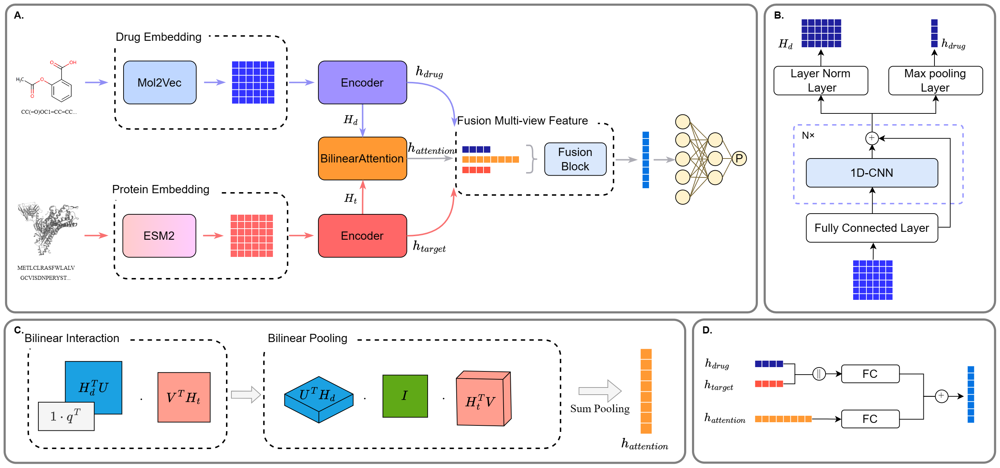

# LLMDTA

LLMDTA: Improving Cold-Start Prediction in Drug-Target Affinity with Biological LLM.



## Requirements

gensim==4.3.1 \
matplotlib==3.2.2 \
mol2vec==0.1 \
numpy==1.23.4 \
pandas==1.5.2 \
rdkit==2023.3.2 \
scikit_learn==1.2.2 \
scipy==1.8.1 \
torch==1.8.2 \
tqdm==4.65.0 \

Install [ESM2](https://github.com/facebookresearch/esm) from repo.

## Resources

- code
  - train.py: Run Script for training.
  - pred.py: Run script for inference.
  - hyperparameter.py: Config for trainning.
  - hyperparameter4pred.py: Config for inference.
  - ...
- code_prepareEmb
  - \_Split5FoldDataset.ipynb: Splite 5-fold CV dataset.
  - \_PreparePretrain.ipynb: In training stage, compute and dump pretraining embeddings.
- data: place training and inference dataset
- savemodel: place inference model.

## Example Usage

### Training with Davis\KIBA\Metz

1. Download Dataset from this [site](https://www.kaggle.com/datasets/christang0002/llmdta/data).

2. Config `hyperparameter.py`

```
self.data_root       : the dataset pth
self.dataset         : the dataset name, davis, kiba or metz
self.running_set     : the task setting, warm, novel-drug, novel-prot or novel-pair

self.mol2vec_dir    : the extracted moleculars pretraining feature
self.protvec_dir    : the targets pretraining feature
self.drugs_dir      : drugs list
self.prots_dir      : targets list

self.cuda           : set the gpu device
```

3. RUN `python code/train.py`

### Training from Your Dataset

If you want to use LLMDTA to training on your dataset. You should prepare the dataset and pretrained feature at first.

In code_prepareEmb folder, we provide notbooks to generate pretrained embedding and split 5 fold cold-start dataset.

1. Prepare Customized Dataset.\
   We expect the training data should using the following format:

- `drugs.csv`\
  ['drug_id', 'drug_smile']
- `targets.csv`\
  ['prot_id','prot_seq']
- `pairs.csv`\
  ['drug_id', 'prot_id', 'label']

2. Generate Pretraining Embeddings. \
   Using `code_prepareEmb/_PreparePretrain.ipynb` to extract the mol2vec and ESM2 pretraining features from drugs.csv and targets.csv.

3. Config `hyperparameter.py`

4. RUN. `python code/train.py`

### Prediction

1. Prepare the drugs and targets in CSV like format.\
   There support two types of inference data.

- User offer Drug-target pairs, [drug_id, prot_id, smiles, prot_seq]
- User offer drug list and target list separately. The inference script automatically computes all possible pairs and makes predictions.
  - drug.csv, [drug_id, drug_smile]
  - prot.csv, [prot_id, prot_seq]

2. Config the `hyperparameter4pred.py` file.

```
self.pred_dataset   : the prediction task name, for saving result
self.sep            : the separator while reading drugs/target list

self.pred_pair_pth  : inference type 1, the drug-target file

self.pred_drug_dir  : type 2, the drugs list file
self.pred_prot_dir  : type 2, the target list file

self.model_fromTrain    : the pretrained model
```

3. Run Prediction. And the result file will saving in current path.

```
python code/pred.py
```
